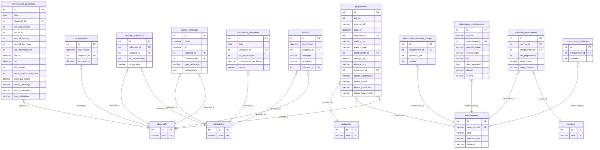

```mermaid
erDiagram
    dispositifs {
        int id PK
        varchar nom UK
    }

    utilisateurs {
        int id PK
        varchar nom UK
    }

    medicaments {
        int id PK
        varchar nom_complet UK
        varchar nom
        varchar concentration
        varchar fabricant
    }

    services {
        int id PK
        varchar nom UK
    }

    conteneurs {
        int id PK
        varchar nom UK
    }

    preparations {
        int id PK
        int job_id
        varchar external_id
        datetime date_fin
        int dispositif_id FK
        varchar patient_nom
        varchar patient_code
        int medicament_id FK
        decimal dosage_mg
        varchar dosage_brut
        int conteneur_id FK
        varchar temps_confirmation
        varchar temps_queue
        varchar temps_production
        varchar temps_final_check
    }

    erreurs {
        int id PK
        datetime date_heure
        int dispositif_id FK
        varchar message
        varchar description
        int utilisateur_id FK
    }

    temperatures {
        int id PK
        datetime date_heure
        int dispositif_id FK
        decimal temperature
    }

    taches_nettoyage {
        int id PK
        datetime debut
        datetime fin
        int dispositif_id FK
        int utilisateur_id FK
        varchar type_nettoyage
        text commentaire
    }

    activite_utilisateurs {
        int id PK
        int utilisateur_id FK
        int dispositif_id FK
        int nb_preparations
        varchar temps_total
    }

    productivite_utilisateurs {
        int id PK
        date date
        int utilisateur_id FK
        int nb_preparations
        decimal preparations_par_heure
        varchar heures
    }

    performance_journaliere {
        int id PK
        date date
        int dispositif_id FK
        int nb_preparations
        int nb_pass
        int nb_fail_dosage
        int nb_fail_technique
        int nb_reconstitutions
        datetime debut
        datetime fin
        int nb_flacons
        int temps_moyen_prep_sec
        decimal pass_par_heure
        varchar temps_allumage
        varchar temps_utilisation
        varchar taux_utilisation
    }

    utilisation_medicaments {
        int id PK
        int service_id FK
        int medicament_id FK
        int nb_preparations
        decimal dose_totale
        varchar unite_mesure
    }

    composants_utilisation {
        int id PK
        int medicament_id FK
        int quantite
    }

    statistiques_medicaments {
        int id PK
        varchar source
        int medicament_id FK
        varchar quantite_totale
        varchar volume_total
        varchar lot
        date date_expiration
        varchar dosage
        varchar volume
    }

    distribution_precision_dosage {
        int id PK
        int medicament_id FK
        int precision_pct
        int nombre
    }

    %% Relations
    preparations }o--|| dispositifs : "dispositif_id"
    preparations }o--|| medicaments : "medicament_id"
    preparations }o--|| conteneurs : "conteneur_id"

    erreurs }o--|| dispositifs : "dispositif_id"
    erreurs }o--|| utilisateurs : "utilisateur_id"

    temperatures }o--|| dispositifs : "dispositif_id"

    taches_nettoyage }o--|| dispositifs : "dispositif_id"
    taches_nettoyage }o--|| utilisateurs : "utilisateur_id"

    activite_utilisateurs }o--|| utilisateurs : "utilisateur_id"
    activite_utilisateurs }o--|| dispositifs : "dispositif_id"

    productivite_utilisateurs }o--|| utilisateurs : "utilisateur_id"

    performance_journaliere }o--|| dispositifs : "dispositif_id"

    utilisation_medicaments }o--|| services : "service_id"
    utilisation_medicaments }o--|| medicaments : "medicament_id"

    composants_utilisation }o--|| medicaments : "medicament_id"

    statistiques_medicaments }o--|| medicaments : "medicament_id"

    distribution_precision_dosage }o--|| medicaments : "medicament_id"
```
